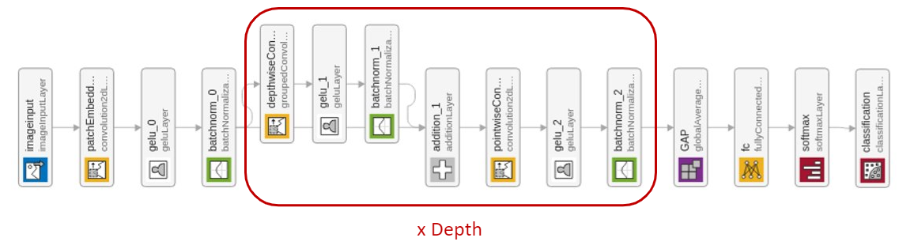

# ConvMixer -- Patches are all you need?

This demo shows how to implement and train a ConvMixer architecture for image classification with MATLAB&reg;, as described in the paper "Patches are all you need?" https://openreview.net/forum?id=TVHS5Y4dNvM

The ConvMixer architecture employs a Patch Embedding representation of the input followed by repeated fully-convolutional blocks.

## How to get started

Start the project ConvMixer.prj to add to the path the relevant functions. There are examples in the `convmixer/examples` folder to get you started with training a ConvMixer for the digits dataset and the CIFAR-10 dataset [1].

The latter employs the ADAM algorithm with fixed weight decay regularization, as described in [2].

Training a ConvMixer for the CIFAR-10 architecture can be demanding in terms of computational resources: in the same `convmixer/examples` folder you can find a pretrained network. This model was trained on the CIFAR-10, available at https://www.cs.toronto.edu/~kriz/cifar-10-matlab.tar.gz

The source code for building the architecture is in the `convmixer/convmixer` directory.

## Requirements

- MATLAB&reg; R2021b or later 
- Deep Learning Toolbox&trade;

## License

The license is available in the license file within this repository.

Copyright 2021 The MathWorks, Inc.

[1] Krizhevsky, Alex. "Learning multiple layers of features from tiny images." (2009). https://www.cs.toronto.edu/~kriz/learning-features-2009-TR.pdf  
[2] Loshchilov, Ilya, and Frank Hutter. "Fixing weight decay regularization in ADAM." (2018). https://openreview.net/forum?id=rk6qdGgCZ
